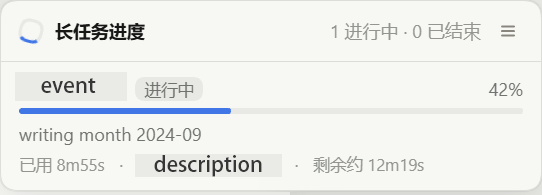

# dsh-task-progress

**Live progress for long-running tasks in DeepSeek Harness.** A script reports
structured progress to a file; the Web UI shows it in a floating overlay and a
right-sidebar tab — no polling the agent, no waiting for the command to finish.

**Version 0.2.0** · MIT · [中文](README.zh.md) · [Changelog](CHANGELOG.md)



*A real session, not a mock-up: the floating panel with one task reporting.*
*Click it to expand, or open the **Task progress** tab in the right sidebar.*

## Why this exists

DSH's `pwsh`/`bash` tools are not streaming: a foreground command's output
appears only when it finishes, and a background job's output lives behind the
model's `job_output` cursor. The session-header job list shows status, but not a
single line of output. So a ten-minute build is a black box to the human watching
the GUI.

This plugin gives long tasks a **second, purpose-built channel** that is theirs to
write and the human's to read.

## Install

```bash
# from npm — one command, which installs the plugin and registers it in the profile
dsh plugin --profile web add dsh-task-progress

# from git, if you would rather install the repository itself
dsh plugin --profile web add github:chen8923/dsh-task-progress

# from a local checkout of this repository (see Development)
./tools/rebuild.ps1 -Profile web -Checkout <path-to-dsh-checkout>
```

DSH mounts a profile bundle at startup, so **restart DSH** afterwards. The plugin
requires the Web profile (`webServer`, `connection`, `shellEnv`, and the right
sidebar); in a composition without them it stays unloaded and changes nothing.

The repository and the npm package share one name, so `dsh plugin add
dsh-task-progress` cannot resolve to somebody else's package — there is no
discovery-name/install-name gap to get wrong here. The git install is also one
command with nothing to allow: the built plugin is committed, so there is no
build step for pnpm to gate.

## Compatibility

| | |
| --- | --- |
| **DSH** | Built and verified against `@deepseek-ai/dsh` 0.1.5-rc.2 (commit `0e77055`), Web profile. |
| **Node** | The plugin runs on Node 20+ (`engines`). The suite needs Node 22.18+ — it executes the TypeScript sources directly through type stripping. |
| **DSH seams used** | `webServer`, `connection`, `shellEnv`, `settings`, `systemPrompt`, `slots`, `sidebarRightTabs`, `locale`, `settingsScope`. Every one is optional at the call site: a composition missing a seam loses that one surface and nothing else. |
| **Dependencies** | None at runtime. The host half imports Node built-ins; the browser half ships everything it owns and treats `react` as a platform external. |
| **Conflicts** | It claims no path another plugin owns. It adds one key to `shell.overlay`, one right-sidebar tab and one settings card — the same additive registration the shipped plugins use — plus its own route, settings namespace and prompt section, all named `task-progress`. |

## Access and footprint

Installing a DSH plugin is not a sandboxed act — the plugin runs in the DSH
process, with that process's privileges. So here is the entire footprint, before
you install rather than after. This is the same table [`SECURITY.md`](SECURITY.md)
commits to, and a mismatch between it and the code is itself a security report.

| Surface | Exactly what happens |
| --- | --- |
| **Files read** | `<root>/.dsh-progress/<session-id>/<task>.jsonl`, tail-only (256 KiB per file by default). `<root>` is a workspace directory a shell call handed the plugin, plus any absolute roots you configure. Nothing else is opened. |
| **Files created** | `<workspace>/.dsh-progress/<session-id>/`, on a session's first shell call. The settings card writes that namespace's user layer through DSH's own settings service. |
| **Shell environment** | Every shell call gains `DSH_PROGRESS_DIR` and `DSH_PROGRESS_CLI`. |
| **Network** | None. No outbound request, no telemetry, no update check, no child process. |
| **HTTP** | One route, `GET`/`HEAD /plugins/task-progress/state`, fenced by DSH's own `connection.requestRejection` before it reads anything, answering for exactly one session at a time, with no filesystem path in the response. |
| **Job mirror** | The browser half draws DSH's own per-session job mirror — the same rows the session header lists: command label, state, elapsed time, exit detail. Client-side only; none of it travels over this plugin's route. |
| **Model context** | One **static** system-prompt section, beside DSH's background-job guidance. At most **one** extra notice per background job, and only for a job that has run past a threshold (default 30 s, `remindAfterMs`) with nothing reported for it; `0` turns it off. |
| **Tools** | **None.** The tool catalogue is untouched — so, unlike most plugins, this one does not push new tool descriptions into the cached prefix. It costs the cache one short prompt section, once, plus the rare notice above. |
| **UI** | One overlay entry, one right-sidebar tab, one settings card — additive keys in shared list slots. |
| **Memory** | Bounded by configuration: `maxTasks` tasks per document, `messagesPerTask` messages per task, `fileTailBytes` per file, and a 64-directory LRU of known progress directories. |

Report a vulnerability through [private vulnerability reporting](SECURITY.md)
rather than a public issue.

## Use

Inside a DSH shell call the plugin hands the script its directory:

```powershell
# PowerShell — one append per event
$line = '{"v":1,"task":"build","state":"running","pct":42,"msg":"linking"}'
[System.IO.File]::AppendAllText(
  (Join-Path $env:DSH_PROGRESS_DIR 'build.jsonl'), $line + "`n",
  [System.Text.UTF8Encoding]::new($false))
```

```bash
# bash
printf '{"v":1,"task":"build","pct":42,"msg":"linking"}\n' >> "$DSH_PROGRESS_DIR/build.jsonl"
```

```python
# Python (any language works — it is just a file)
import json, os
path = os.path.join(os.environ["DSH_PROGRESS_DIR"], "build.jsonl")
with open(path, "a", encoding="utf-8") as handle:
    handle.write(json.dumps({"v": 1, "task": "build", "pct": 42, "msg": "linking"}) + "\n")
```

Or let the bundled helper do the quoting:

```bash
node "$DSH_PROGRESS_CLI" emit --task build --pct 42 --msg "linking"
node "$DSH_PROGRESS_CLI" done --task build --msg "shipped"
node "$DSH_PROGRESS_CLI" list          # print what the directory currently says
```

Try it with no setup at all:

```powershell
pwsh ./examples/simulate.ps1 -Task demo -Steps 30 -DelayMs 500
```

Then open the **Task progress** tab in the right sidebar (or click the floating
pill once it appears).

### Out of the box

Installing the plugin is enough for the *agent* to know the convention: the host
half contributes a short section to the system prompt, right where the
background-jobs guidance already is, so the model arranges progress reporting for
long commands on its own. There is nothing to configure and no `AGENTS.md` edit —
a feature that only works after you edit your own instructions is not one you can
install.

If you want it stronger, or you run a composition without that prompt seam, the
same instruction can live in your workspace `AGENTS.md`:

```markdown
## Long-running tasks
For any command expected to run longer than ~30s, wrap it:

```
node "$env:DSH_PROGRESS_CLI" run --task <id> -- <your command>
```

That announces the task, follows the output, reports a percentage when it can read
one, and writes the ending from the exit code — no script to write, no redirection
or encoding to get right, and the task id ends up in the command line, which is
what ties the row to the job. Anything it cannot express can still report by hand:
one JSON line per event to `$DSH_PROGRESS_DIR/<task>.jsonl` (see the
dsh-task-progress protocol), or
`node "$env:DSH_PROGRESS_CLI" emit --task <id> --pct N --msg "..."`.
Never read the progress file back — it is for the human.
```

### When nothing appears

The panel draws two kinds of row.

A task a **script** reported arrives with its percentage, its counters and its
messages. A background job nobody reported for still shows up: DSH already pushes
a per-session job mirror for its own job list, and that mirror carries the command
line, how long the job has run and how it ended — so the plugin draws those rows
instead of showing nothing. What it will not do is invent detail: with no script
reporting there is no percentage, and the group's own note says so rather than
implying a bar that does not exist.

A job in a session you are not looking at stays invisible, because every surface
here is scoped to the session in view.

### When the script is killed

A task's ending is normally written by the script, which is a problem the moment
something kills the script: `job_kill` terminates the process tree, and on
Windows that is `taskkill`, which runs **no user code at all**. A `finally` block
does not run, no handler runs, and the terminal line is not late — it is never
coming. Measured, not assumed: a background `pwsh` job with a `finally` that
appends to a file, killed with `job_kill`, wrote nothing after the kill.

So the ending does not depend on the script getting there. The Host half asks
DSH's job registry, whose record outlives the process and says how it ended, and
a task still saying `running` whose **writing job has ended** is published as
ended: `killed` reads as cancelled, `failed` as failed, a clean exit as done. The
row says so underneath — *process was killed without reporting an ending* — so an
inference is never passed off as a report, and the file itself is left exactly as
the producer wrote it.

Three things make that inference land, and they are worth knowing when you write
the script:

- **Name the task after something in the command line.** The row is matched to
  the job by the same label heuristic the unreported-job rows use, so
  `--task sync-catalog` inside the command line is recognised and a task named
  `job1` in a command that never says `job1` is not.
- **One writer per task id**, or one id per stage. Three jobs appending to one
  file is not a task with three writers; it is a task whose ending two of them
  cannot write.
- **Write the ending anyway.** `try/finally` still covers exceptions, Ctrl+C, and
  the ordinary path, and the ending carries the real outcome and message. It is
  the *only* thing that covers a machine that dies, so it is worth having — it is
  simply not the only thing that ends a row.

## Settings

The plugin registers one settings namespace, so its knobs are editable where
every plugin's are: **Settings → Plugins → Plugin configuration → Task progress**.

| Field | Default | Meaning |
| --- | --- | --- |
| Scan interval (ms) | `1000` | How often the Host half re-reads changed progress files. |
| Poll interval (ms) | `2000` | How often the browser asks for progress. |
| Keep finished for (ms) | `1800000` | How long a finished task stays listed. |
| Messages per task | `30` | Recent messages kept per task. |
| Max tasks | `200` | Cap on tasks in one state document. |
| File tail bytes | `262144` | Bytes read from the tail of one progress file. |
| Extra roots | – | Absolute paths whose `.dsh-progress` is scanned too. |
| Remind the model after silence (ms) | `30000` | How long a background job may report nothing before the model is told once. This one spends the model's context, so it is here to be turned down; `0` never reminds. |
| Float for jobs that report nothing | off | Whether the floating panel may appear for a job whose script reports no progress. Off by default — it is still listed in the sidebar tab. |

Saving writes the namespace's user layer into `$DSH_HOME/settings.yaml`; pressing
**Reset** (or emptying a field) removes the override, so the value falls back to
the plugin row's `config` and then to the schema default. Changes apply live: a
new scan interval re-arms the Host loops on their next tick, and the state
document's `pollMs` follows the value the browser should use.

`dirName` is deliberately absent from the panel — it is part of every path
already written, so it stays a composition-level setting on the plugin row.

## Design

Three layers, each independently replaceable — the point is that neither a
producer nor the UI knows about the other, and neither knows about DSH internals.

| Layer | What it is | Why it is shaped that way |
| --- | --- | --- |
| **Protocol** (`docs/PROTOCOL.md`) | Append-only JSONL, one file per task | Any language, no IPC, no ports, no auth, survives restarts. Works with the plugin uninstalled — the files are just files. |
| **Host half** | `ctx.shellEnv` contributor + directory poll + one HTTP route + a system-prompt section + one agent-step listener | Uses only public DSH seams (`webServer`, `connection`, `shellEnv`, `settings`, `systemPrompt`, `jobs`), and reads the job registry as **non-consuming snapshots** — never `read()`, which owns the output cursor. |
| **Browser half** | One polling store, two panels (`shell.overlay` + a sidebar tab), and a settings card | The panels read the same snapshot and the card reads its own namespace scope, so adding or removing a surface never touches the data path. |

**Why the plugin does not read job output.** `ctx.jobs.read()` consumes a
single-consumer cursor that belongs to the model's `job_output` tool; a browser
path reading it would silently steal bytes the model can then never see (DSH
pins that as a tested invariant). Progress here is therefore something the
*script* chooses to report, which is what makes this plugin safe to install
alongside anything else.

**Snapshots are not output.** The same registry also offers `list()`, whose
snapshots carry lifecycle facts only — id, kind, the command label, timestamps,
and how the job ended. Observing those is a different act from consuming the
output cursor, and it is what lets this plugin do three things it otherwise could
not: draw a row for a job nobody reported for, tell the model once, at the step
where it can still act, that a long job is running unseen, and settle a task
whose writer was killed before it could report an ending. Two consumers of the
same cursor would be a bug; two observers of a snapshot are not.

**The registry is read, never written to.** A settled ending changes what the
Host half *publishes* for a task and nothing else: the progress file keeps the
producer's last words, so a script that resumes and appends `running` again
supersedes the inference by itself, and deleting the file still deletes the task.
That is the whole reason the fix belongs in the reading rather than in a
correction written back to the file — a reader that rewrites its input cannot be
reasoned about.

**Why polling instead of push.** The data is a couple of kilobytes of JSON on
localhost, and a poll loop is the one design that cannot desynchronize: every
reader sees the same last-wins document, a missed tick costs one interval, and
there is no reconnect logic to get wrong. The interval comes from the Host
half's configuration.

**Zero dependencies.** The host half imports Node built-ins only; the browser
half bundles everything it owns and treats `react` as a platform external. That
extends to the settings schema: `ctx.settings.register` takes a schemastery
schema, and this plugin supplies a minimal compatible node — callable for
resolution, `toJSON()` in schemastery's reference-graph form, and walkable by the
settings redactor — instead of depending on a package that a profile install
cannot resolve. Its own browser card passes a decoder so it never has to
rehydrate a schema envelope at all.

### What it deliberately does not do

- **No history.** Progress is live state, not a log; finished tasks age out.
- **No cancel button.** Stopping a job is the model's `job_kill` (a human-initiated
  interrupt needs a delivery-semantics decision this plugin does not own).
- **No remote producers.** Everything is local files in the workspace the session
  already writes to.
- **No session lookup.** Directories are learned from the shell calls that were
  handed them, plus configured roots — so the plugin never revives a session or
  reads a path the browser suggested.
- **No cross-session reads.** The state endpoint answers for exactly one session
  per request and puts no filesystem path on the wire. DSH's web login fences the
  whole instance rather than a session, so an endpoint that answered with
  everything the process knows would hand any authenticated caller every other
  session's task names and messages.

## Development

```bash
npm test          # 168 tests, one process (works in restricted sandboxes)
npm run test:runner   # the same suite through node --test
npm run build         # requires tsdown
```

Source layout:

```
src/protocol.ts        the shared contract (pure, bundled into both halves)
src/host/              settings namespace, store, shell-environment contributor, HTTP route, prompt section, entry
src/client/            polling store, formatting, settings form, React components, slots, styles
bin/dsh-progress.mjs   the dependency-free producer CLI
docs/PROTOCOL.md       the file contract and every configuration key
test/                  seventeen suites: protocol, job reconciliation, store,
                       formatting, host wiring, settings, settings form, prompt
                       section, session hook, client store, CLI, wrapper, bundle,
                       settings chrome, privacy, release
tools/                 test entry and the build/pack/install script
```

**`lib/` is committed, and that is load-bearing.** A git-hosted package that has
to build needs pnpm's build-script allowlist, whose key contains the exact commit
— so the install would take two steps and the second one would change on every
push. Shipping the build makes it one command, at the cost of discipline: after
any source change, run `npm run build` and commit `lib/` in the same commit.
`test/bundle.test.ts` fails if the build is missing, is not a loader bundle, or
no longer carries what the sources define. `prepublishOnly` still builds for
`npm publish`. The suites run on Node 22.18+ (they execute the TypeScript sources
directly through type stripping), while the plugin itself runs on Node 20+.

**The bundler is pinned, and Dependabot is told to leave it alone.** `tsdown` and
`typescript` are held at exact versions because a bundler release changes the
bytes of the committed `lib/` — the build that ships to users and to git installs.
A bump and a rebuild belong in one commit, and a bot can only open the first half
of that, so `.github/dependabot.yml` ignores those two dependencies entirely. That
includes their **security** pull requests: the option is documented as changing how
Dependabot creates security updates too. What remains is the Dependabot **alert**
on the Security tab, and that is the signal to act — bump, `npm run build`,
confirm `test/bundle.test.ts` still passes, and commit `lib/` in the same commit.
Everything else (the workflows' actions, the lockfile) still gets its automatic
pull requests, which is where automation belongs.

**`screenshots.json` is marketplace metadata, not a build input.** Plugin
directories and dsh-market show the UI capture it names on a plugin's detail
page, and the convention is that the repository declares it rather than the
list: 1–8 paths relative to this file, none leaving the plugin directory. It
changes nothing at runtime, and the image it names is the one `docs/` already
ships.

### Releasing

```bash
npm test                                  # 168 checks, one process
git push && git tag v0.2.0 && git push origin v0.2.0   # CI publishes it, with provenance
npm publish                               # manual fallback: builds first, then publishes
```

`test/release.test.ts` fails if the version in `package.json` is not also stated
in both READMEs and the changelog, if a documented example is missing from
`files`, or if the repository links disagree with the install instructions — so
the four places a version or a URL appears cannot drift apart.

Tagging publishes through `.github/workflows/publish.yml`, once the trusted
publisher is configured on npm (repository `chen8923/dsh-task-progress`, workflow
`publish.yml`). That path holds no token, and it attaches a signed provenance
attestation tying the tarball to the commit. A hand-run `npm publish` keeps
working for as long as npm lets a 2FA-bypassing token publish — it retires that
in January 2027 — but it can never carry provenance.

## License

MIT
